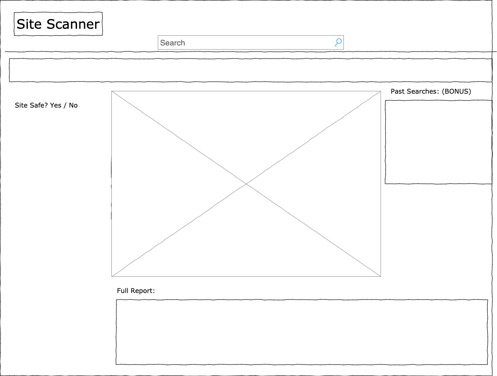

#### Name: Site Scanner

#### Elevator Pitch:  

Test out if a site is reputable by requesting the site's repuatation from Auth0, Google, and get a screenshot of the site just by entering a link.  The user can enter a site, see an image and get a "yes or no" this is okay.

#### Wireframe:

#### Dependencies:
APIs:
www.thum.io/
https://auth0.com/signals/ip
https://developers.google.com/safe-browsing/v4/request-frequency

React:
React
react-router-dom
grid or material ui
firebase (auth)

Bonus Items:
Auth and Store Items in Firebase

#### Tasks:

1.  Create basic site that renders a UI with a screenscraper and make sure this has a clean look. 

2.  Add testing + add Auth.

3.  Add in calls to Auth0 for site usage.

4.  Add testing.

5.  Add in calls for Google Safe Browsing. 

#### Week 1:
- Clean UI showing a screenshot of a site when entered.  

#### Week 2:
- Ability to call APIs, render data and add testing.  Add Auth.  Determine if site is "safe" yes/no.

### Week 3:
- I need an ability to say if the site is "safe" or not without having the user parse a lot of data.  I think this is pretty easy but if not I'll be working on it week 3.  Else, time to finish any bonus items, e.g add a site to a list and store locally or in Firebase.  

